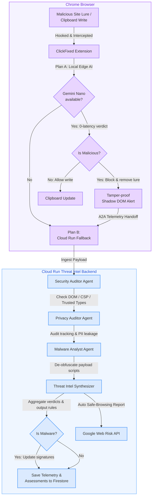

# 🛡️ ClickFixed

**AI-powered browser defense against ClickFix / ClearFake / FakeUpdates social engineering attacks.**

ClickFixed was developed as a capstone project for the [Kaggle AI Agents: Intensive Vibe Coding Course](https://www.kaggle.com/competitions/vibecoding-agents-capstone-project/). It is an on-device cybersecurity shield that stops clipboard-hijacking and DOM-lure attacks at point zero, combining a proactive **Chrome Extension sensor agent** running in the browser with a multi-step **Cloud Threat Intelligence pipeline** to audit and immunize users in real time.

---

## 🏗️ Interactive Showcase & Demo

To help developers, researchers, and users understand the architecture of this multi-agent security pipeline, we have built two interactive client-side simulators included directly in this public repository:

1.  **[Interactive Presentation Dashboard](https://marontis.github.io/clickfixed/)**:  
    A stunning, animated walkthrough demonstrating how a threat payload flows from clipboard interception in the Chrome Sandbox, through local Gemini Nano edge evaluation, and up into the Cloud multi-agent system.
2.  **[Local Threat Simulator](https://marontis.github.io/clickfixed/test_clickfix.html)**:  
    An offline testing dashboard that lets you trigger simulated clipboard hijack scenarios, Blob items writes, and captcha lure injections to test interception mechanics.

---

## 🛡️ Architecture Overview

The ClickFixed framework uses a two-tier defense model to ensure security, privacy, and low latency:

### 1. On-Device Sensor Agent (Chrome Extension)
*   **Interception world**: Hooks into `navigator.clipboard.writeText` and the newer `ClipboardItem` API at browser startup.
*   **Proactive Lure Deletion**: A MutationObserver actively scans the page DOM. When a modal Captcha lure is injected, it is immediately deleted from the page to prevent user interaction.
*   **Edge AI Verdicts**: If a clipboard write is caught, the extension prompts Chrome's built-in **Gemini Nano** model for a zero-latency, privacy-safe classification. If malicious, the write is blocked.
*   **Closed Shadow DOM Alert**: Injects warning overlays via closed Shadow roots that target pages cannot access, hide, or manipulate.

### 2. Multi-Agent Cloud Backend
If on-device evaluation is inconclusive or requires deep forensic investigation, the extension hands over sanitized DOM context and telemetry payloads to the Cloud run ADK pipeline using the **Agent-to-Agent (A2A)** protocol:
*   **Security Auditor**: Analyzes DOM and HTTP headers to detect missing CSP/Trusted Types configurations.
*   **Privacy Auditor**: Checks page contexts for user tracking pixels, script leaks, or PII exposures.
*   **Malware Analyst**: De-obfuscates PowerShell caret symbols, base64 strings, and de-cloaks script payloads.
*   **Threat Intel Synthesizer**: Compiles active signatures (regex patterns) and pushes them to database collections to immunize users globally.

---

## 🔒 Privacy & Data Minimization
ClickFixed is built with privacy by design. The sensor agent strips all query parameters and fragments from URLs (`sanitizeCurrentUrl()`) before transmitting telemetry, exposing only the domain host origin (e.g. `victim-portal.com`) to protect user browsing histories.

---

## 📂 Repository Contents
This public release package contains:
*   `presentation.html` — Interactive multi-agent pipeline visualizer.
*   `test_clickfix.html` — Offline attack simulator testing page.
*   `malicious_tracker.js` — Client-side simulation script.
*   `store_assets/` — Chrome Web Store assets and listing graphics.
*   `CHROMEWEBSTORE.md` — Store permissions and privacy policies.
