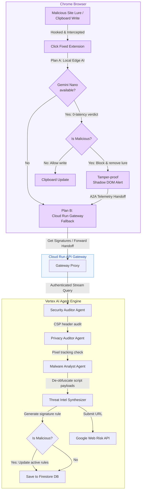
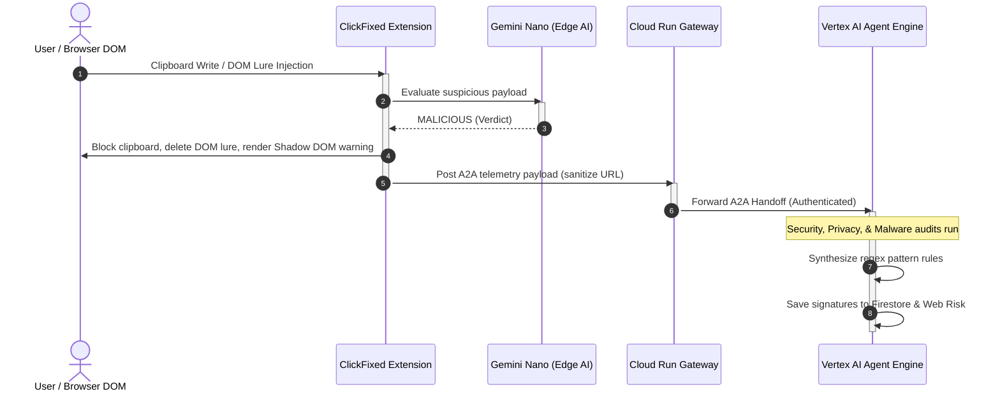

# 🛡️ Click Fixed

**AI-powered browser defense against ClickFix / ClearFake / FakeUpdates social engineering attacks.**

A two-part defense system: a **Chrome Extension sensor agent** that intercepts attacks directly in the browser DOM, and a **Google ADK Multi-Agent Threat Intelligence Pipeline** hosted on the **Google Cloud Agent Platform (Vertex AI Agent Engine)**, fronted by a lightweight **Cloud Run API Gateway** that autonomously proxies and traces threat telemetry.

---

## 🏗️ Architecture






#### Detailed Execution Sequence:

*   **`01` Exploitation Attempt**: A compromised website silently attempts to inject a modal lure or write a malicious payload to the user's clipboard.
*   **`02` Real-time Interception**: The isolated script hooks (`injected.js` / `content_script.js`) capture the API call or DOM change in under 30ms.
*   **`03` Edge AI Decision**: Gemini Nano locally evaluates the script parameters. If it identifies malware indicators:
    *   **Proactive Quarantine**: The modal node is instantly removed from the active DOM.
    *   **Clipboard Block**: The write action is rejected.
    *   **Shadow DOM Warning**: A tamper-proof alert overlay (`warning_ui.js`) notifies the user.
*   **`04` Telemetry Handoff**: The service worker (`background.js`) sanitizes the source URL and forwards the payload context to the Google Cloud Run ADK pipeline.
*   **`05` ADK Orchestrated Audit**:
    *   **Security Auditor**: Audits CSP header rules.
    *   **Privacy Auditor**: Protects against tracking pixel leaks.
    *   **Malware Analyst**: De-obfuscates PowerShell scripts and decodes payload triggers.
    *   **Intel Synthesizer**: Generates signature rules.
*   **`06` Immunization & Reporting**:
    *   **Firestore**: Stores telemetry and active signatures.
    *   **Google Web Risk**: Automatically reports threat origins.
    *   **Abuse Lookup**: Searches compromised host's `security.txt` to email abuse contacts.

### Advanced Defense Capabilities
- **ClipboardItem API Hooking**: Intercepts modern, complex clipboard payloads designed to evade traditional `writeText` hooks.
- **Proactive Lure Deletion**: A MutationObserver actively scans the DOM. If a malicious lure (e.g., a fake captcha modal asking you to press Win+R) is injected, Gemini Nano evaluates it, and the extension **physically removes the malicious node from the DOM** before the user can even interact with it.
- **Shadow DOM Isolation**: The warning UI is injected using a `mode: 'closed'` Shadow Root, meaning the malicious website cannot use JavaScript or CSS to hide, tamper with, or dismiss the warning.
- **Graph-based Multi-Agent Orchestration**: The backend is powered by a graph-based workflow of ADK specialists, each loading specific Markdown **Skills** (like `threat-intelligence` and `cpp-on-the-web`) to guide their analysis.

---

## 🛠️ Project Structure

```text
clickfixed/
├── extension/
│   ├── manifest.json           # MV3 manifest with options_ui
│   ├── background.js           # Service worker: AI analysis + A2A client
│   ├── content_script.js       # Isolated world: AI pipeline + Proactive DOM Scanner
│   ├── injected.js             # Main world: navigator.clipboard API interception
│   ├── warning_ui.js           # Tamper-proof Shadow DOM warning panel
│   ├── icons/                  # Extension icons
│   ├── popup/                  # Live threat dashboard popup
│   └── options/                # User dashboard and Cloud Run connectivity status
│
├── agent/
│   ├── agent.py                # Core ADK Workflow and Agent Graph definitions
│   ├── gateway.py              # Starlette API gateway proxy for Cloud Run
│   ├── deploy.py               # Deploy script to package & deploy agent to Agent Platform
│   ├── skills/                 # Markdown-based Skill definitions loaded by Agents
│   ├── requirements.txt        # Python dependencies
│   └── Dockerfile              # Container configuration for Cloud Run Gateway
│
├── infra/                      # Terraform Infrastructure as Code (IaC)
│   └── main.tf                 # Cloud Run, Firestore, and GCS staging bucket provisioning
│
└── test_clickfix.html          # Local attack simulator with 5 distinct test scenarios
```

---

## 🚀 Setup & Installation

### 1. The Chrome Extension

The extension is designed to be completely zero-configuration for end-users. **No API keys are required.**

* **Direct Installation**: Install the published extension directly from the [Chrome Web Store](https://chromewebstore.google.com/detail/click-fixed/eolbjikeobaakljmancpfgommfpmhgfp).
* **Manual/Developer Mode**:
  1. Go to `chrome://extensions` and enable **Developer mode**.
  2. Click **Load unpacked** and select the `extension/` folder in this repository.
  3. Pin the extension to your toolbar.
* **Enable Edge AI (Gemini Nano)**: *(Optional but Recommended)* Enable **Gemini Nano** in Chrome for zero-latency, on-device evaluations:
   - `chrome://flags/#prompt-api-for-gemini-nano` → **Enabled**
   - `chrome://flags/#optimization-guide-on-device-model` → **Enabled BypassPerfRequirement**
   - Go to `chrome://components` → Find **Optimization Guide On Device Model** → Click **Check for update**.

### 2. The Agent Backend (Google Cloud Agent Platform & Gateway)

The backend heavy lifting is managed on the **Google Cloud Agent Platform** (using Vertex AI Agent Engine) with an API Gateway proxy hosted on **Cloud Run**.

1.  **Configure Environment**: Add variables to `infra/terraform.tfvars` (using [infra/terraform.tfvars.example](file:///c:/Users/gamer/Documents/Projects/clickfixed-dev/infra/terraform.tfvars.example) as a guide).
2.  **Deploy Infrastructure**: Run Terraform to enable required APIs, provision the Native Firestore database, Artifact Registry, and the GCS staging bucket:
    ```bash
    cd infra
    ./terraform.exe init
    ./terraform.exe apply
    ```
3.  **Deploy the Reasoning Engine**: Use `uv` to automatically package the ADK agent and skills and upload them to Vertex AI:
    ```bash
    cd ../agent
    $env:PROJECT_ID="YOUR_PROJECT_ID"; $env:REGION="YOUR_REGION"
    uv run --python 3.12 --with google-cloud-aiplatform[agent_engines] --with cloudpickle --with "google-adk[a2a,mcp]" --with google-generativeai --with httpx --with python-dotenv deploy.py
    ```
4.  **Build & Deploy Gateway Container**: Push the gateway container using GCP Cloud Build and force deploy to Cloud Run:
    ```bash
    # Push build to Artifact Registry
    gcloud builds submit --tag us-central1-docker.pkg.dev/YOUR_PROJECT_ID/clickfixed-agent-repo/agent:latest .
    
    # Deploy to Cloud Run
    gcloud run deploy clickfixed-threat-agent --image us-central1-docker.pkg.dev/YOUR_PROJECT_ID/clickfixed-agent-repo/agent:latest --region us-central1 --project YOUR_PROJECT_ID
    ```
5.  **Teardown**: To shut down services and prevent cloud costs, run:
    ```bash
    cd infra
    ./terraform.exe destroy
    ```


---

## 🧪 Testing the Defense

Open `test_clickfix.html` in Chrome. This local dashboard contains 5 interactive scenarios designed to test the extension's resilience:

1. **Scenario 1: Legitimate Copy** - Verifies the AI does not falsely block safe clipboard writes.
2. **Scenario 2: Standard Attack** - A classic hidden PowerShell payload execution bypass.
3. **Scenario 3: Obfuscated Test** - Uses carets (`c^m^d`) and backticks to bypass regex heuristics, forcing the AI to step in.
4. **Scenario 4: ClipboardItem API** - Attempts to write blobs using the newer, complex ClipboardItem API.
5. **Scenario 5: Proactive Modal Lure** - Injects a dynamic DOM modal asking the user to press Win+R. The extension proactively scans, evaluates, and physically removes the modal from the page.

---

## 🔒 Security Architecture

| Threat Vector | Mitigation Strategy |
|---|---|
| **API Key Leakage** | All Cloud APIs (Web Risk, Deep Gemini Analysis) are restricted to the Cloud Run backend. End-users do not configure or expose API keys. |
| **DOM Tampering** | The warning UI is injected via a `mode: 'closed'` Shadow DOM. The malicious site's JS cannot access the `shadowRoot` to hide or dismiss the warning. |
| **Bypass via Obfuscation** | Dynamic regex heuristics act as a fast-pass, but all payloads are ultimately judged by the semantic understanding of the Gemini model, defeating obfuscation tricks. |
| **Telemetry Privacy** | The extension strips query parameters and fragments from URLs (`sanitizeCurrentUrl()`) before sending telemetry to the ADK backend to prevent PII leakage. |
